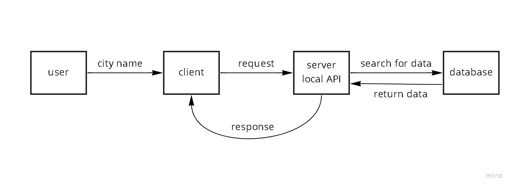

# city-explorer-api
At this repo we will build our API server 

**Author**: Fahad Zidan
**Version**: 1.0.0 

## Overview
This Application has been built to work as a local server using express framework to receive requests and send response with static data stored in .json file.

## Getting Started
<!-- What are the steps that a user must take in order to build this app on their own machine and get it running? -->

## Architecture
- express framework.
- Node js.
- Error handling.
## Change Log

03-08-2022 4:59pm - Application now has a fully-functional express server, with a GET route for the location resource.

## Credit and Collaborations

[Wlla'a Talafha](https://github.com/WllaTalafha)

I would like to thank here for all collaborations during the lab.
